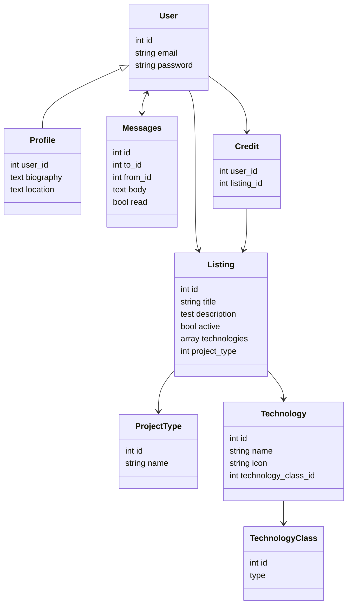

# techgigs.app

TechGigs.app is a marketplace for tech workers to pick up side gigs

### ProjectType

| type    | platform       |
| ------- | -------------- |
| desktop | cross platform |
| desktop | macOS          |
| desktop | windows        |
| desktop | linux          |
| mobile  | iOS            |
| mobile  | android        |
| mobile  | cross platform |
| web     | full stack     |
| web     | backend        |
| web     | frontend       |

### TechnologyClass

| class                |
| -------------------- |
| Programming Language |
| Framework            |
| Database             |
| Cloud Provider       |
| Operations           |

### Programming Languages

- JavaScript
- TypeScript
- ruby
- Go
- python
- rust
- C
- C++
- C#
- Java
- Scala
- Visual Basic
- SQL
- php
- Objective-C
- MATLAB
- Swift
- R
- Perl
- Julia
- Lua
- Scala
- Kotlin
- elixir
- erlang

### Frameworks

### Data Store

- postgresql
- MySql
- MarisDB
- oracle
- MS sql server
- MongoDB
- IBM DB2
- Redis
- Elasticsearch
- Cassandra
- OrientDB
- SQLite
- DynamoDB
- Neo4j
- Firebase
- FileMaker
- Microsoft Access

### Cloud Providers

- Amazon Web Services
- Google Cloud Platform
- Microsoft Azure
- Digital Ocean
- Heroku

### Operations

- Docker
- Kubernetes
- Github Actions
- Gitlab DevOps
